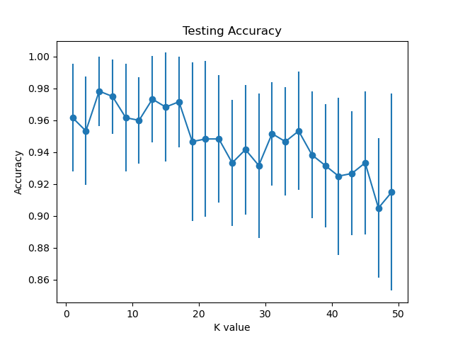
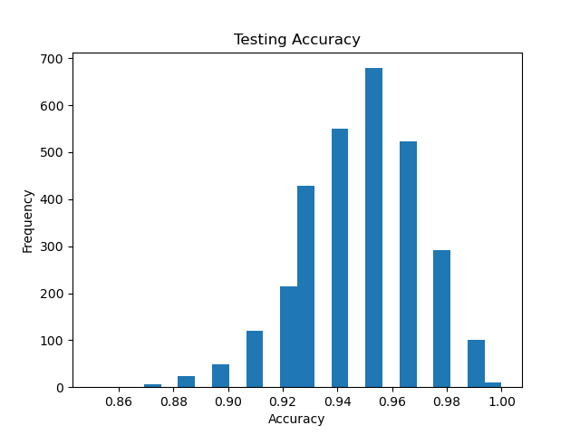
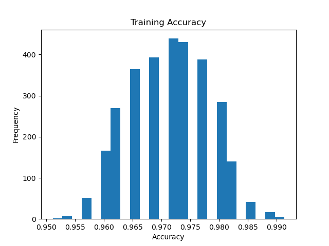
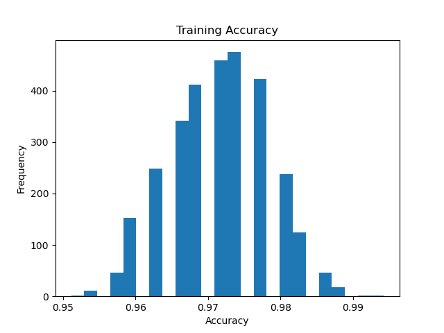
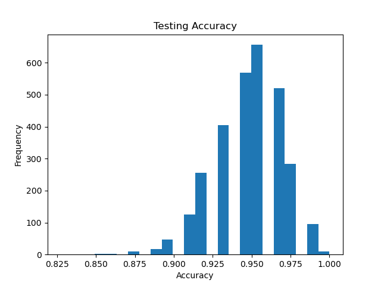

Q1.1

Q1.2

Q1.3
The training graph is hishest is both at 1 and around 10, and then it starts to decrease from then. The reason is I think when K get larger, It will predict the instance based on the more common neighbors, so when K increases, the accuracy will decrease as the closest neighbors will be come unrelevant as K increases.
For the testing graph, the graph seems to fluctuate, however, the accuracy is a bit lower than the training graph. This is reasonable since the model never sees the validation set whereas, it improves on the training set, but the accuracy will decrease like the training graph, with the same reason I explained above.

Q1.4
For the two graphs, it seems to be me there is no overfitting as well as underfitting, because both graph seems to perform well on both graph, and the pattern is the same when K increases, they reach their max accuracy when K is around 10

Q1.5
If I get to choose a value K for fine-tuning real life problem, K would be around 15-20% of the whole dataset, so the model will predict on the closest neighbors.

Q2.1

The mean for training is 0.9716484674329501
The standard deviation for training is 0.0067213947286664626

Q2.2

The mean for testing is 0.9483141762452107
The standard deviation for testing is 0.02156101119611793
Q2.3

Q2.4

Q2.4

Extra:

The mean for gini training is 0.9713898467432949
The standard gini deviation for training is 0.00671112464825539

The mean for gini testing is 0.9475823754789271
The standard gini deviation for testing is 0.02192871268409976